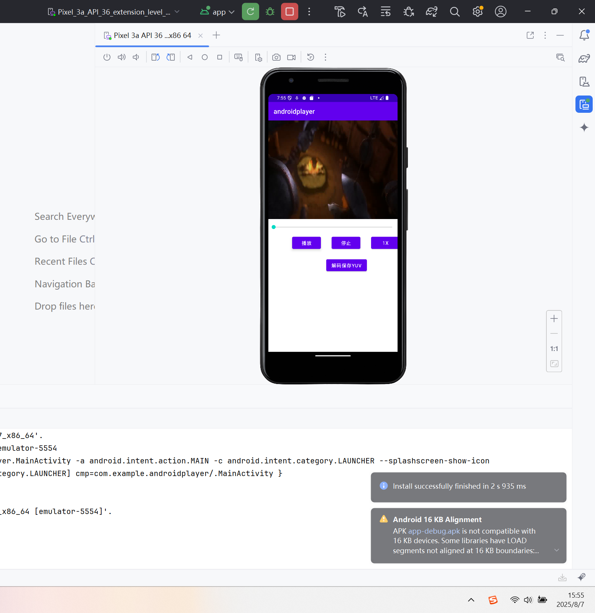
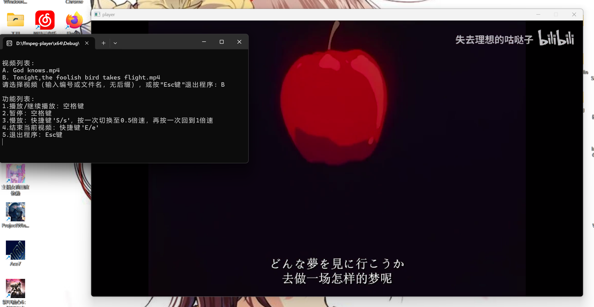

# Androidplayer（Android app）

## 项目简介
基于FFmpeg实现的Android视频播放器，实现对单一音视频的播放等功能

## 核心功能
- 功能1：将视频流解码为YUV格式并保存
- 功能2：渲染、播放视频流

## 环境要求
- Android系统
- 需要授予文件访问权限
- 视频文件：`/sdcard/1.mp4`（手机根目录下）
- YUV输出文件：`/sdcard/output.yuv`

## 使用说明
1. 安装应用并授予权限
2. 确保`/sdcard/1.mp4`文件存在
3. 启动应用进行播放
4. YUV文件将自动保存到指定路径

## 示例

# ffmpeg-player（Windows视频播放器）

## 项目简介
基于FFmpeg和SDL实现的Windows视频播放器，支持多线程解码和音视频同步播放

## 核心功能
- 功能1：解复用、解码音视频流，支持MP4、MKV、AVI格式
- 功能2：音频播放（SDL音频）与视频渲染（SDL窗口）
- 功能3：播放控制（播放/暂停/倍速/停止）
- 功能4：音视频同步（以音频时钟为基准）

## 环境要求
- Windows系统
- 依赖库：
  - FFmpeg库（avcodec, avformat, avutil, swscale, swresample）
  - SDL2库（SDL2, SDL2_ttf）
  - C++17或更高版本编译器
- 视频文件存放在`./videos`目录下

## 使用说明
1. 将视频文件放入`./videos`目录
2. 运行程序，按提示选择视频
3. 使用快捷键控制播放：
   - 空格键：播放/暂停
   - S/s键：切换倍速（0.5x/1.0x）
   - E/e键：结束当前视频
   - Esc键：退出程序

## 技术特点
- 多线程架构：解复用、音频解码、视频解码分离运行
- 队列通信：使用线程安全的PacketQueue和FrameQueue
- 同步机制：音频时钟为主时钟，视频同步到音频
- 资源管理：RAII风格，确保资源正确释放

## 示例

